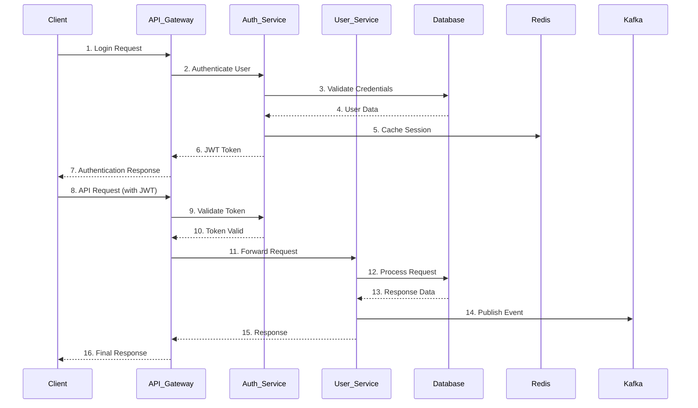
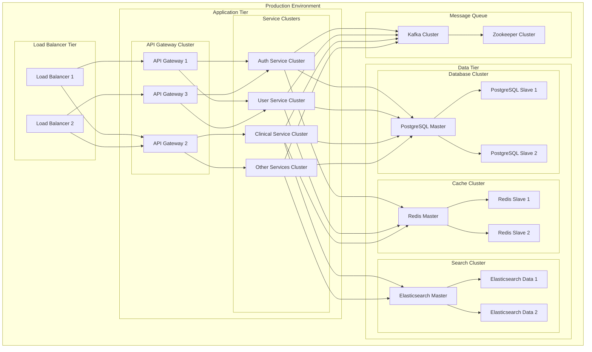

# Healthcare Platform System Design

## Architecture Overview

The Kiorex Healthcare Platform is built using a microservices architecture with comprehensive monitoring, security, and compliance features.

## System Architecture Diagram

```mermaid
graph TB
    %% External Systems
    subgraph "External Systems"
        WEB[Web Application]
        MOBILE[Mobile App]
        API_CLIENT[API Clients]
        THIRD_PARTY[Third-party Systems]
    end

    %% Load Balancer & API Gateway
    subgraph "API Gateway Layer"
        LB[Load Balancer]
        GW[API Gateway<br/>Port 3000]
    end

    %% Core Services
    subgraph "Core Services"
        AUTH[Auth Service<br/>Port 3001]
        USER[User Service<br/>Port 3002]
        PAYMENT[Payment Service<br/>Port 3004]
        APPT[Appointment Service<br/>Port 3005]
    end

    %% Healthcare Services
    subgraph "Healthcare Services"
        CLINICAL[Clinical Service<br/>Port 3006]
        NOTIF[Notification Service<br/>Port 3007]
        SEARCH[Search Service<br/>Port 3008]
        VIDEO[Video Service<br/>Port 3009]
        ANALYTICS[Analytics Service<br/>Port 3010]
    end

    %% Specialized Services
    subgraph "Specialized Services"
        LAB[Lab Service<br/>Port 3011]
        PHARMACY[Pharmacy Service<br/>Port 3012]
        SURGERY[Surgery Service<br/>Port 3013]
        NURSE[Nurse Service<br/>Port 3014]
        DOCUMENT[Document Service<br/>Port 3015]
        ADMIN[Admin Service<br/>Port 3016]
    end

    %% Data Layer
    subgraph "Data Layer"
        POSTGRES[(PostgreSQL<br/>Port 5432)]
        REDIS[(Redis<br/>Port 6379)]
        ELASTIC[(Elasticsearch<br/>Port 9200)]
        MINIO[(MinIO S3<br/>Port 9000)]
    end

    %% Message Queue
    subgraph "Message Queue"
        KAFKA[Kafka<br/>Port 9092]
        ZOOKEEPER[Zookeeper<br/>Port 2181]
    end

    %% Monitoring
    subgraph "Monitoring & Observability"
        PROMETHEUS[Prometheus<br/>Port 9090]
        GRAFANA[Grafana<br/>Port 3030]
        JAEGER[Jaeger<br/>Port 16686]
        ALERTMANAGER[AlertManager<br/>Port 9093]
    end

    %% External Integrations
    subgraph "External Integrations"
        STRIPE[Stripe API]
        TWILIO[Twilio API]
        SENDGRID[SendGrid API]
        FIREBASE[Firebase]
    end

    %% Connections
    WEB --> LB
    MOBILE --> LB
    API_CLIENT --> LB
    THIRD_PARTY --> LB

    LB --> GW

    GW --> AUTH
    GW --> USER
    GW --> PAYMENT
    GW --> APPT
    GW --> CLINICAL
    GW --> NOTIF
    GW --> SEARCH
    GW --> VIDEO
    GW --> ANALYTICS
    GW --> LAB
    GW --> PHARMACY
    GW --> SURGERY
    GW --> NURSE
    GW --> DOCUMENT
    GW --> ADMIN

    AUTH --> POSTGRES
    AUTH --> REDIS
    AUTH --> KAFKA

    USER --> POSTGRES
    USER --> REDIS
    USER --> MINIO

    PAYMENT --> POSTGRES
    PAYMENT --> REDIS
    PAYMENT --> STRIPE

    APPT --> POSTGRES
    APPT --> REDIS
    APPT --> KAFKA

    CLINICAL --> POSTGRES
    CLINICAL --> REDIS
    CLINICAL --> KAFKA

    NOTIF --> POSTGRES
    NOTIF --> REDIS
    NOTIF --> KAFKA
    NOTIF --> SENDGRID
    NOTIF --> TWILIO
    NOTIF --> FIREBASE

    SEARCH --> POSTGRES
    SEARCH --> ELASTIC
    SEARCH --> REDIS

    VIDEO --> POSTGRES
    VIDEO --> REDIS
    VIDEO --> TWILIO

    ANALYTICS --> POSTGRES
    ANALYTICS --> ELASTIC
    ANALYTICS --> REDIS

    LAB --> POSTGRES
    LAB --> REDIS
    LAB --> KAFKA

    PHARMACY --> POSTGRES
    PHARMACY --> REDIS
    PHARMACY --> KAFKA

    SURGERY --> POSTGRES
    SURGERY --> REDIS
    SURGERY --> KAFKA

    NURSE --> POSTGRES
    NURSE --> REDIS
    NURSE --> KAFKA

    DOCUMENT --> POSTGRES
    DOCUMENT --> REDIS
    DOCUMENT --> MINIO

    ADMIN --> POSTGRES
    ADMIN --> REDIS
    ADMIN --> KAFKA

    KAFKA --> ZOOKEEPER

    %% Monitoring connections
    PROMETHEUS --> AUTH
    PROMETHEUS --> USER
    PROMETHEUS --> PAYMENT
    PROMETHEUS --> APPT
    PROMETHEUS --> CLINICAL
    PROMETHEUS --> NOTIF
    PROMETHEUS --> SEARCH
    PROMETHEUS --> VIDEO
    PROMETHEUS --> ANALYTICS
    PROMETHEUS --> LAB
    PROMETHEUS --> PHARMACY
    PROMETHEUS --> SURGERY
    PROMETHEUS --> NURSE
    PROMETHEUS --> DOCUMENT
    PROMETHEUS --> ADMIN
    PROMETHEUS --> POSTGRES
    PROMETHEUS --> REDIS
    PROMETHEUS --> ELASTIC
    PROMETHEUS --> KAFKA

    GRAFANA --> PROMETHEUS
    ALERTMANAGER --> PROMETHEUS

    %% Styling
    classDef service fill:#e1f5fe,stroke:#01579b,stroke-width:2px
    classDef database fill:#f3e5f5,stroke:#4a148c,stroke-width:2px
    classDef external fill:#fff3e0,stroke:#e65100,stroke-width:2px
    classDef monitoring fill:#e8f5e8,stroke:#1b5e20,stroke-width:2px

    class AUTH,USER,PAYMENT,APPT,CLINICAL,NOTIF,SEARCH,VIDEO,ANALYTICS,LAB,PHARMACY,SURGERY,NURSE,DOCUMENT,ADMIN service
    class POSTGRES,REDIS,ELASTIC,MINIO database
    class STRIPE,TWILIO,SENDGRID,FIREBASE external
    class PROMETHEUS,GRAFANA,JAEGER,ALERTMANAGER monitoring
```

## Data Flow Architecture

## Security Architecture

```mermaid
graph TB
    subgraph "Security Layers"
        subgraph "Network Security"
            FIREWALL[Firewall]
            WAF[Web Application Firewall]
            DDoS[DDoS Protection]
        end

        subgraph "Application Security"
            JWT[JWT Authentication]
            RBAC[Role-Based Access Control]
            ENCRYPTION[Data Encryption]
            VALIDATION[Input Validation]
        end

        subgraph "Data Security"
            DB_ENCRYPTION[Database Encryption]
            BACKUP_ENCRYPTION[Backup Encryption]
            TRANSMISSION_ENCRYPTION[TLS/SSL]
            KEY_MANAGEMENT[Key Management]
        end

        subgraph "Monitoring & Compliance"
            AUDIT_LOGS[Audit Logging]
            SIEM[Security Monitoring]
            COMPLIANCE[Compliance Monitoring]
            INCIDENT_RESPONSE[Incident Response]
        end
    end

    FIREWALL --> WAF
    WAF --> DDoS
    DDoS --> JWT
    JWT --> RBAC
    RBAC --> ENCRYPTION
    ENCRYPTION --> VALIDATION
    VALIDATION --> DB_ENCRYPTION
    DB_ENCRYPTION --> BACKUP_ENCRYPTION
    BACKUP_ENCRYPTION --> TRANSMISSION_ENCRYPTION
    TRANSMISSION_ENCRYPTION --> KEY_MANAGEMENT
    KEY_MANAGEMENT --> AUDIT_LOGS
    AUDIT_LOGS --> SIEM
    SIEM --> COMPLIANCE
    COMPLIANCE --> INCIDENT_RESPONSE
```

## Deployment Architecture

## Technology Stack

### Backend Services
- **Framework**: NestJS (Node.js)
- **Language**: TypeScript
- **Runtime**: Node.js 18+

### Databases
- **Primary Database**: PostgreSQL 15
- **Cache**: Redis 7
- **Search**: Elasticsearch 8.10
- **Object Storage**: MinIO (S3-compatible)

### Message Queue
- **Message Broker**: Apache Kafka
- **Coordination**: Apache Zookeeper

### Monitoring & Observability
- **Metrics**: Prometheus
- **Visualization**: Grafana
- **Tracing**: Jaeger
- **Alerting**: AlertManager

### Security
- **Authentication**: JWT with Passport.js
- **Authorization**: Role-Based Access Control (RBAC)
- **Encryption**: AES-256 for data at rest, TLS 1.3 for data in transit
- **Audit**: Comprehensive audit logging

### External Integrations
- **Payments**: Stripe
- **Communications**: Twilio (SMS, Video), SendGrid (Email)
- **Push Notifications**: Firebase
- **File Storage**: AWS S3 (optional)

## Scalability Considerations

### Horizontal Scaling
- **Stateless Services**: All services are stateless and can be horizontally scaled
- **Load Balancing**: Multiple instances behind load balancers
- **Database Sharding**: Horizontal partitioning for large datasets
- **Cache Distribution**: Distributed Redis cluster

### Performance Optimization
- **Connection Pooling**: Database connection pooling
- **Caching Strategy**: Multi-level caching (Redis, application-level)
- **CDN Integration**: Content delivery network for static assets
- **Database Indexing**: Optimized database indexes

### High Availability
- **Multi-AZ Deployment**: Services deployed across multiple availability zones
- **Database Replication**: Master-slave replication with automatic failover
- **Health Checks**: Comprehensive health monitoring and auto-recovery
- **Backup Strategy**: Automated backups with point-in-time recovery

## Compliance & Security

### Regulatory Compliance
- **HIPAA**: Healthcare data protection compliance
- **GDPR**: European data protection regulation
- **Egypt PDPL**: Egyptian personal data protection law

### Security Measures
- **Data Encryption**: End-to-end encryption
- **Access Controls**: Multi-factor authentication and RBAC
- **Audit Logging**: Comprehensive audit trails
- **Incident Response**: Automated incident detection and response

### Privacy Protection
- **Data Minimization**: Collect only necessary data
- **Purpose Limitation**: Use data only for specified purposes
- **Retention Policies**: Automated data retention and disposal
- **Consent Management**: Granular consent tracking and management
